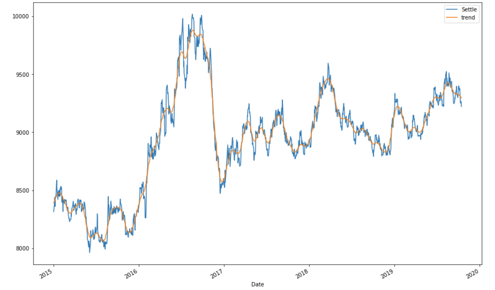
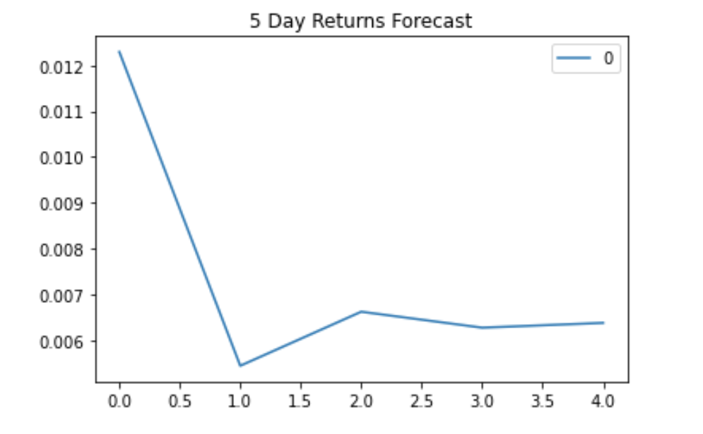
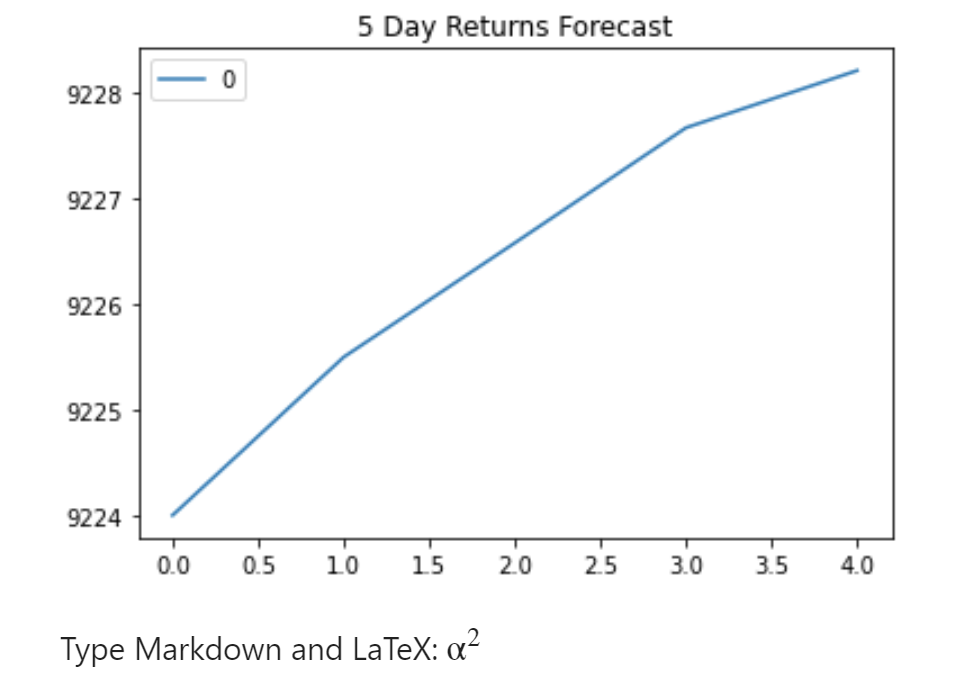
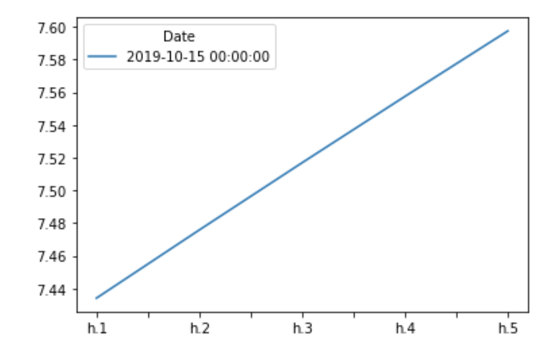

# A Yen for the Future

## Background

The financial departments of large companies often deal with foreign currency transactions while doing international business. As a result, they are always looking for anything that can help them better understand the future direction and risk of various currencies. Hedge funds, too, are keenly interested in anything that will give them a consistent edge in predicting currency movements.

Test the many time-series tools that you have learned in order to predict future movements in the value of the Japanese yen versus the U.S. dollar.

You will gain proficiency in the following tasks:

1. Time Series Forecasting
2. Linear Regression Modeling

- - -

### Instructions

#### Time-Series Forecasting

 Load historical Dollar-Yen exchange rate futures data and apply time series analysis and modeling to determine whether there is any predictable behavior.

1. Decomposition using a Hodrick-Prescott Filter (Decompose the Settle price into trend and noise).
2. Forecasting Returns using an ARMA Model.
3. Forecasting the Settle Price using an ARIMA Model.
4. Forecasting Volatility with GARCH.

#### Linear Regression Forecasting

Build a Scikit-Learn linear regression model to predict Yen futures ("settle") returns with *lagged* Yen futures returns and categorical calendar seasonal effects (e.g., day-of-week or week-of-year seasonal effects).

1. Data Preparation (Creating Returns and Lagged Returns and splitting the data into training and testing data)
2. Fitting a Linear Regression Model.
3. Making predictions using the testing data.
4. Out-of-sample performance.
5. In-sample performance.

- - -

### Hints and Considerations

* Out-of-sample data is data that the model hasn't seen before (Testing data).
* In-sample data is data that the model was trained on (Training data).

 ---
  
 ## Regression Analysis
 
 
 
 ### RMSE
 

Conclusion
Out of sample rmse is .41 , In sample rmse is .59 . Because of these two results it is rare that the mean squared error of our test data resulted higher then the training data. The possible reason that this can happen is if we're using an under fitted predicted data set.

It's possible that the out of sample data provides a better (rsme) if we balance the data set used for the prediction. However, if it does not balance the data used to train the model becomes questionable.

 
 ---
 
 
 ## Time Series Analysis
 
 ### Trend
 
 
 
 
 
 ---
 
 
 ### ARMA Model
 
 

 
 ---
 
 
 ### ARIMA Model
 
 

 
 
 ---
 
 ### GARCH Model
 
 
 

### Conclusion 

Conclusions
Based on your time series analysis, would you buy the yen now?

Based on the analysis, Yes I would buy the yen currency, because over the period anaylized the settle price of the currerncy looks volatile. ALso the currency trend at the end of the period is an upward  trend.

Is the risk of the yen expected to increase or decrease?

 Yes, the risk of yen is ecpected to increase because  it's very volatilety  

Based on the model evaluation, would you feel confident in using these models for trading?

Based on the models I wouldn't use them for trading purposes because the p-vlaue's are greater then .05  which  questions the relibility of the model. Hence,  I would try to look for additionl features that impacts a heavier wieght in the model output. 
